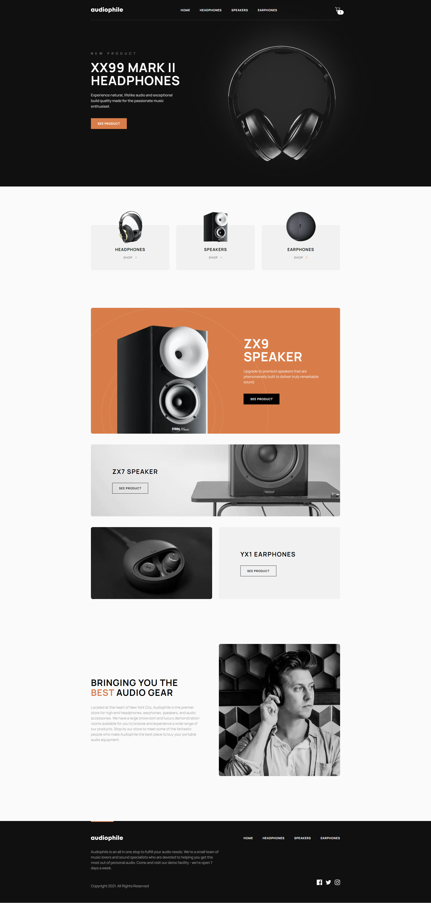
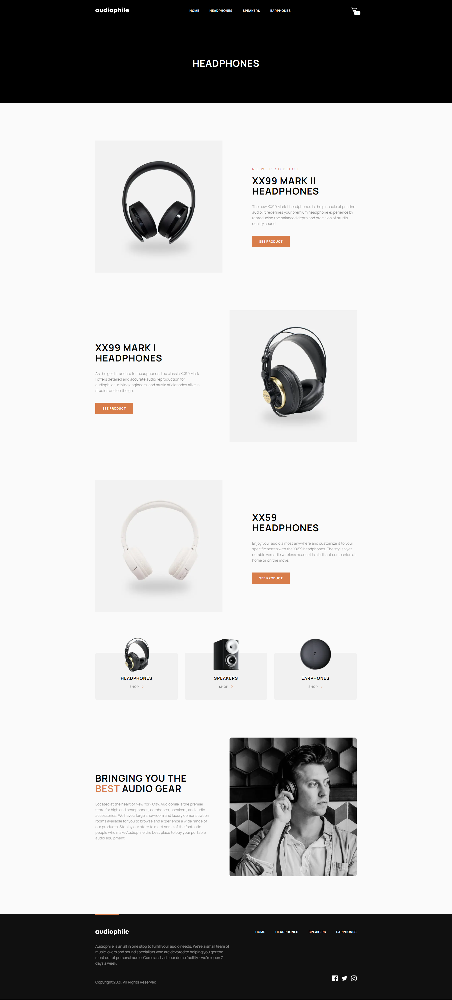
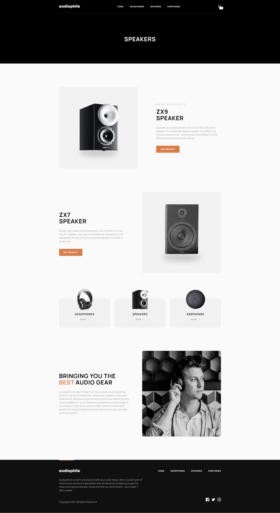
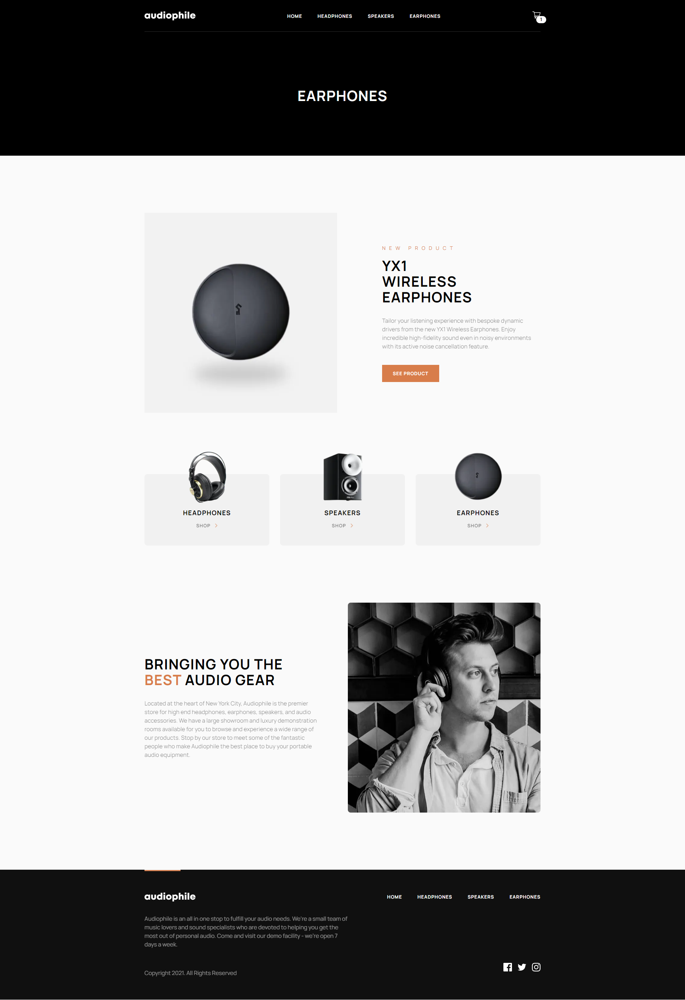
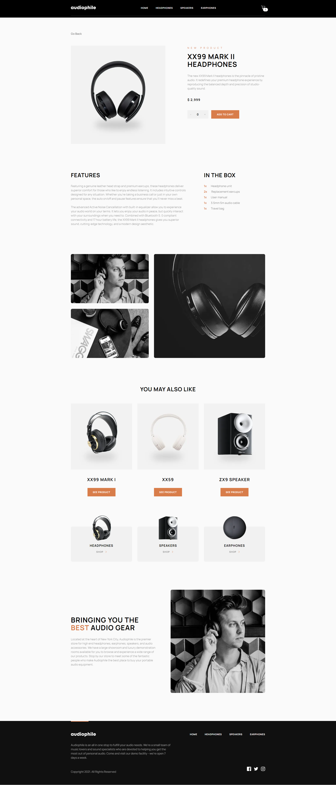
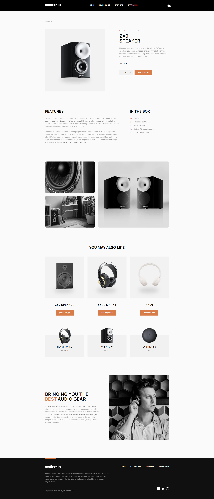
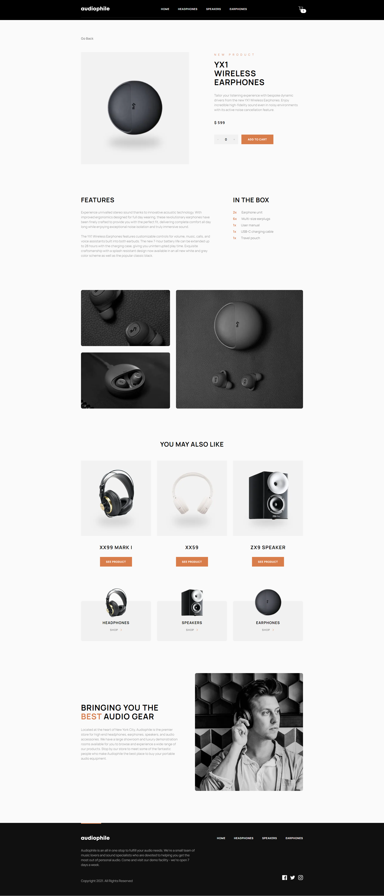
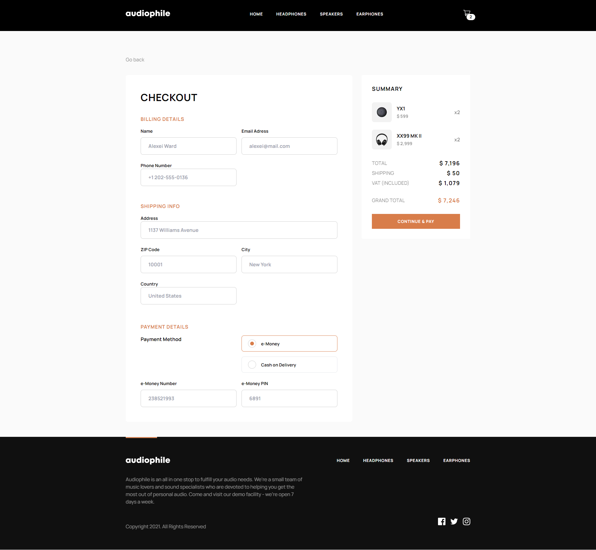
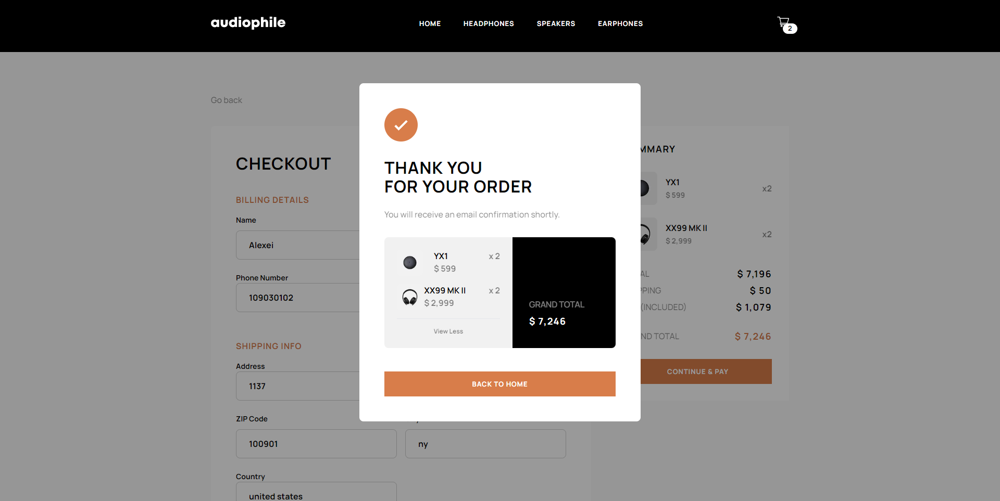

<h1 align="center">🎧Audiophile Website</h1>

<h4 align="center">
    This project is a challenge that I took from <a href="https://www.frontendmentor.io/challenges/audiophile-ecommerce-website-C8cuSd_wx">frontendmentor.io </a> 
    which consists of building an e-commerce website related to sound electronic products🎧. 
</h4>
 

<h4 align="center">
    <a align="center" href="https://www.frontendmentor.io/solutions/responsive-audiophile-website-project-using-nextjs-and-tailwind-css-RG_gnwqtey">Front-end mentor challenge.</a> //
     <a align="center" href="https://audiophile-website-lyart.vercel.app/">Audiophile Website</a>
</h4>

 

<h6 align="center"> This project was created with:</h6>
 
 

    
    
    
    
 

  

<!-- Desktop -->
<h2 align="center">Desktop Version 🖥️</h2>

<!--Made By Gustavo J. Souza -->
